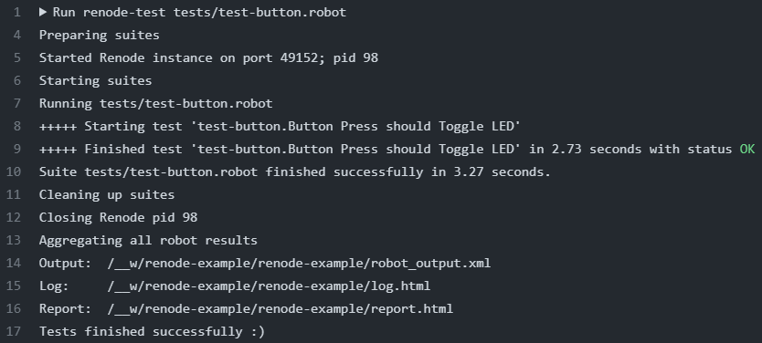

# Renode Example

Simple example of how to use [Renode](https://renode.io/) together with
[Robot Framework](https://robotframework.org/) to emulate and test firmware
on a host PC without the target hardware.

The project builds for an STM32
[NUCLEO-F446RE development board](https://www.st.com/en/evaluation-tools/nucleo-f446re.html).
The default repl (`REnode PLatform`) file for this board has been modified to
include the blue user button functionality. Pressing and releasing this button
toggles one of the on-board LEDs.

## Toolchain

- GNU Arm Embedded Toolchain 10-2020-q4-major
- GNU Make 4.2.1
- Renode 1.14.0
- STM32CubeMX 6.8.1 (*for initial project setup only*)

## Building the project

After installing the required packages on your machine (consider using the
provided `Dockerfile` together with the
[Dev Containers extension](https://code.visualstudio.com/docs/devcontainers/containers)
for VS Code), you can build the project by running:

```bash
cd nucleo-f446re/ButtonLed
make
```

This should create the compiled binaries under the
`nucleo-f446re/ButtonLed/build` directory.

## Testing with Renode

After building the binaries, run the following command from the main directory
to test for the expected behavior:

```bash
renode-test tests/test-button.robot
```

Sample output from GitHub Actions after the test has run successfully:


